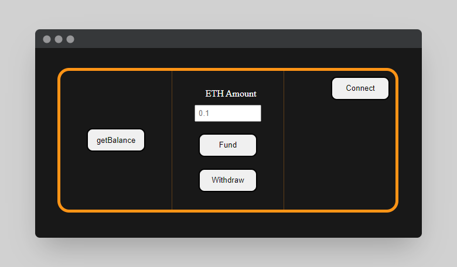

<h1 align="center">
    Frontend Hardhat Fund Me
</h1>

<br/>
 
Frontend part of a Hardhat project that manages the funding and withdrawal from a smart contract for an hypothetical project.

<hr/>

## 🗎&nbsp; Requirements
- [git](https://git-scm.com/book/en/v2/Getting-Started-Installing-Git)
    You'll know you did it right if you can run `git --version` and you see a response like `git version x.x.x`
    
- [Metamask](https://metamask.io/)
    This is a browser extension that lets you interact with the blockchain.
    
- [Nodejs](https://nodejs.org/en/)

    You'll know you've installed nodejs right if you can run: `node --version` and get an ouput like: `vx.x.x`
- [Yarn](https://yarnpkg.com/getting-started/install) instead of `npm`
   
   You'll know you've installed yarn right if you can run: `yarn --version` and get an output like: `x.x.x`
   
   You might need to [install it with `npm`](https://classic.yarnpkg.com/lang/en/docs/install/) or `corepack`

## 🛠️&nbsp; How to run
- Clone the repo:
    ```
    git clone https://github.com/Meno96/fund-me-frontend.git
    ```
- Enter the directory:
    ```
    cd fund-me-frontend
    ```
- Install packages:
    ```
    yarn
    ```
- Run the file

  You can usually just double click the file to "run it in the browser". Or you can right click the file in your VSCode and run "open with live server".

  Or if you'd like to run with prettier formatting, or don't have a way to run your file in the browser, run:
  ```
  yarn http-server
  ```

You will be redirected to the following web page:

<p align="center">
    
</p>

## 🚀&nbsp; How it's suppose to work?

Hit the `Connect` button, and you should see Metamask pop up.

### Execute a transaction

- Open up a second terminal and run:

    ```
    git clone https://github.com/Meno96/fund-me-backend.git
    ```
    ```
    cd fund-me-backend
    ```
    ```
    yarn
    ```
    ```
    yarn hardhat node
    ```

    This will deploy a sample contract and start a local hardhat blockchain.

- Update your `constants.js` with the new contract address:
    In your `constants.js` file, update the variable `contractAddress` with the address of the deployed "FundMe" contract. You'll see it near the top of the hardhat output.

- Connect your [Metamask](https://metamask.io/) to your local hardhat blockchain.

    > **PLEASE USE A METAMASK ACCOUNT THAT ISNT ASSOCIATED WITH ANY REAL MONEY.**
    > I usually use a few different browser profiles to separate my metamasks easily.

    In the output of the above command, take one of the private key accounts and [import it into your Metamask.](https://metamask.zendesk.com/hc/en-us/articles/360015489331-How-to-import-an-Account)

    Additionally, add your localhost with chainid 31337 to your Metamask.

5. Reserve the front end with `yarn http-server`, input an amount in the text box, and hit `fund` button after connecting

## 🏴‍☠️&nbsp; Backend
You can find the backend part in [this repository](https://github.com/Meno96/fund-me-backend.git)

## 📫&nbsp; Have a question? Want to chat? 

[LinkedIn](https://www.linkedin.com/in/daniele-menin/)

[Instagram](https://www.instagram.com/danielemeno96/)
